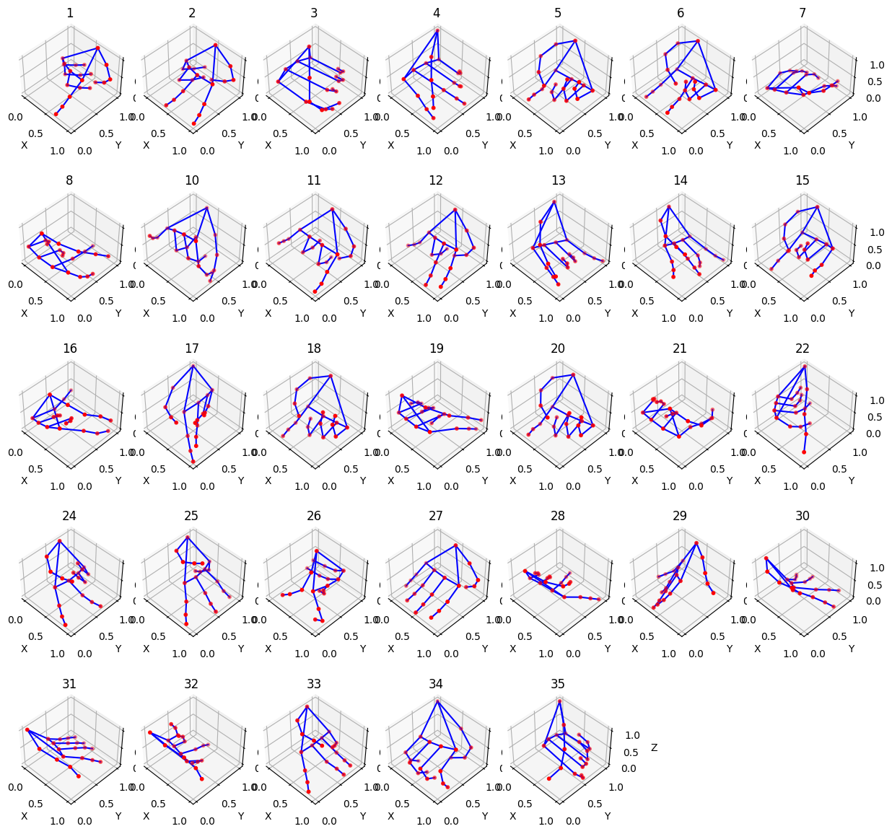

# 전공수업) 고급딥러닝 팀프로젝트

## Topic : Deep-Learning Based FingerSpelling Translator

영상 출처 : https://www.youtube.com/watch?v=OOnuoUl4gP4
  1. 우선 시작 단계로 유튜브에서 영상을 다운받고, 각 동작 별 프레임을 따로 나눔
    
  2. 동작 별 프레임에 대해 MediaPipe 모델과 접목시킴
    
  3. MediaPipe를 통해 나온 Hand Landmark 좌표 데이터를 생성
    
  4. 좌표 데이터를 누적하여 Regression Model에 학습
  5. 최종 실시간 자문자 타자 입력 여부를 확인

## Flowchart & Guide
(continue..)

## Consideration

- 데이터 부족으로 인한 증강 기법에 대한 고려 (Fashion MNIST, Sign MNIST 등 유사한 데이터셋)
- 
- 개인 별로 수집한 데이터의 Bias를 고려하여 Similarity를 계산 ?
  - Euclidean Distance ->  Dynamic Time Warping
  - Cosine Similarity

